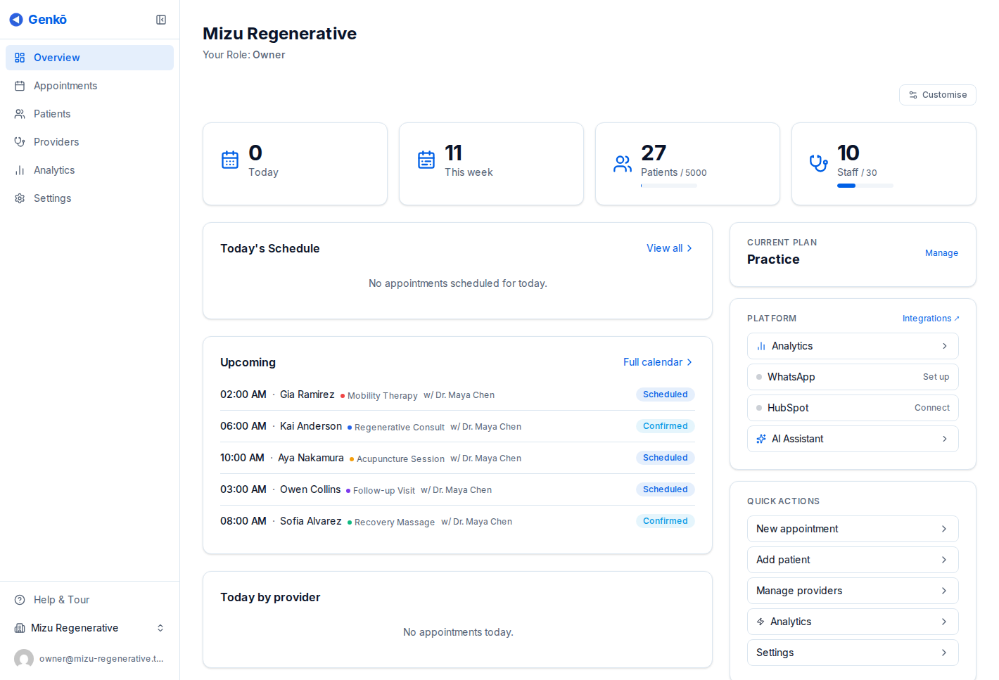

# Dashboard

Das **Overview**-Dashboard ist Ihre operative Zentrale. Es bietet eine Live-Ansicht von Buchungen, Aktivität, Planverbrauch und wichtigen Abkürzungen, ohne dass Sie zwischen Seiten wechseln müssen.

---

## Was das Dashboard zeigt

### Statistikleiste

Oben auf der Seite hebt Genkō die Zahlen hervor, die die meisten Praxen zuerst prüfen:

- Heutige Termine
- Terminanzahl dieser Woche
- Gesamtzahl der Patienten
- Teamgröße

Jede Kennzahl wird zusammen mit einer Nutzungsanzeige dargestellt, damit Sie schnell sehen, wie nah Sie an den Grenzen Ihres Plans sind.

### Tagesübersicht

Dieser Abschnitt listet die Termine des aktuellen Tages mit Patient, Uhrzeit, Leistung, Anbieter und Terminstatus auf. Das ist die schnellste Möglichkeit zu sehen, was gerade passiert.

### Kommende Termine

Genkō zeigt außerdem die nächsten Termine der kommenden Tage an. Das hilft dabei, Lücken zu erkennen, das Team vorzubereiten oder die Anbieterabdeckung zu prüfen.

### Schnellaktionen

Schnellaktionen bringen Sie direkt zu häufigen Aufgaben:

- Einen Termin erstellen
- Einen Patienten hinzufügen
- Anbieter verwalten
- Analysen öffnen

### Planinformationen

Ihr aktueller Plan und der Abonnementstatus sind im Dashboard sichtbar, damit Eigentümer und Admins Nutzung und verfügbare Funktionen im Blick behalten.

---

## Plattform-Funktionskarten

Bei **Group**-Plänen und höher sehen Admins zusätzlich Live-Statuskarten für erweiterte Funktionen wie:

- Analysen
- WhatsApp
- HubSpot
- KI-Assistent

Diese Karten dienen als schneller Status-Check und als Abkürzung zur Konfiguration.

---

## Layout anpassen

Verwenden Sie **Customize** oben rechts in Overview, um Dashboard-Bereiche ein- oder auszublenden oder neu anzuordnen. Die Einstellungen werden in Ihrem Browser gespeichert.

---

## Wann das Dashboard besonders nützlich ist

Das Dashboard eignet sich besonders für:

- Den schnellen Tagesstart mit einem Blick auf die Agenda
- Die Prüfung des Planverbrauchs, bevor Mitarbeiter eingeladen oder Patienten hinzugefügt werden
- Den Einstieg in dringende operative Aufgaben
- Das Öffnen der Analysen, nachdem Sie einen Trend entdeckt haben

---

## Best Practices

- Nutzen Sie das Dashboard jeden Morgen als ersten Anlaufpunkt.
- Halten Sie Schnellaktionen auf die wichtigsten Teamaufgaben fokussiert.
- Prüfen Sie Funktionskarten nach einem Plan-Upgrade, damit neue Möglichkeiten nicht unkonfiguriert bleiben.

---

## Verwandte Leitfäden

- [Erste Schritte](./01-erste-schritte.md)
- [Terminplanung und Termine](./06-terminplanung.md)
- [Analysen und Insights](./08-analysen.md)
