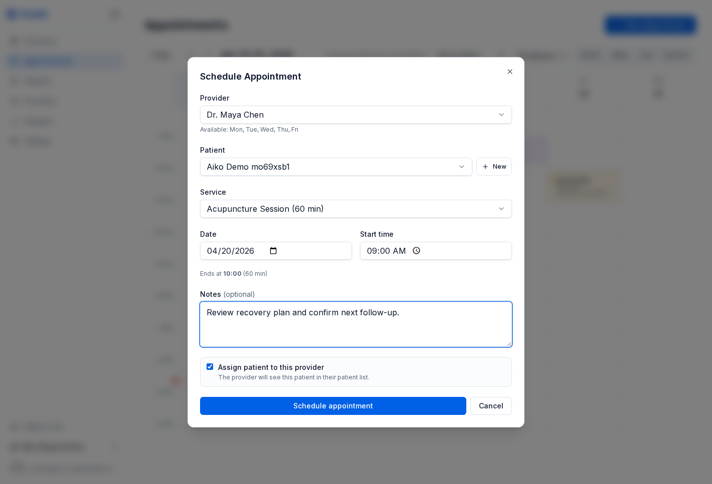

# Terminplanung und Termine

Termine sind der zentrale Workflow in Genkō. Die Planungsoberfläche ist darauf ausgelegt, Buchungen schnell zu halten und Anbieter gleichzeitig vor Konflikten und Überbuchungen zu schützen.

---

## Einen Termin buchen

Klicken Sie auf **New Appointment** auf der Seite **Appointments**.

Der Buchungsablauf umfasst typischerweise:

- **Patient** - Suche nach Name oder E-Mail, oder den Patienten direkt inline anlegen
- **Provider** - Auswahl aus den für Datum und Uhrzeit verfügbaren Anbietern
- **Service** - Auswahl der Terminart, die die Standarddauer setzt
- **Date and time** - Buchung in ein verfügbares Zeitfenster
- **Notes** - optionale interne Notizen für Ihr Team

Wenn E-Mail-Benachrichtigungen aktiviert sind, werden Terminbestätigungen nach dem Speichern automatisch versendet.

---

## Kalenderansichten

Verwenden Sie die Steuerelemente oben in **Appointments**, um zwischen folgenden Ansichten zu wechseln:

- **Day view** für detaillierte Planung Stunde für Stunde
- **Week view** für das beste Gleichgewicht aus Detail und Überblick
- **Month view** für langfristige Sichtbarkeit

Zusätzlich können Sie nach Anbieter filtern, damit sich das Team auf eine Person konzentriert oder den gesamten Praxiskalender sieht.

---

## Konflikterkennung

Genkō verhindert Doppelbuchungen in Echtzeit.

- Ist ein Anbieter bereits gebucht, wird das kollidierende Zeitfenster nicht gespeichert.
- Konfliktprüfungen laufen auf dem Server, sodass auch gleichzeitige Buchungsversuche durch mehrere Mitarbeitende abgesichert sind.
- Nicht verfügbare Zeiten werden bereits vor dem Speichern ausgegraut angezeigt.

Bei **Practice**-Plänen und höher können **Buffer-Minuten** automatisch Lücken zwischen Terminen einfügen.

---

## Terminstatus

Termine durchlaufen einen einfachen operativen Lebenszyklus:

| Status | Bedeutung |
|--------|-----------|
| Scheduled | Die Buchung ist bestätigt und erscheint im Kalender |
| Completed | Der Termin hat erfolgreich stattgefunden |
| Cancelled | Der Termin wurde abgesagt und das Zeitfenster wieder freigegeben |
| No-show | Der Patient ist nicht erschienen |

Mitarbeitende, Anbieter und Admins können Terminstatus in der Detailansicht aktualisieren. Nur Owners und Admins können Termine löschen.

---

## Warum Statuspflege wichtig ist

Korrekte Statuswerte verbessern:

- Produktivitätsberichte pro Anbieter
- Analysen zu No-shows
- Kalendergenauigkeit für Neubuchungen
- Patientenkommunikation und Nachverfolgung

Wenn Sie steigende No-show-Raten bemerken, kombinieren Sie diese Seite mit Erinnerungs-Workflows und Portal-Konfiguration.

---

## Empfohlener Ablauf

1. Patientendatensatz anlegen oder bestätigen
2. Die richtige Leistung auswählen
3. Mit passendem Anbieter und Zeitfenster buchen
4. Nach dem Termin den Status aktualisieren
5. No-shows und Stornierungen in den Analysen prüfen

---

## Verwandte Leitfäden

- [Patienten](./04-patientenverwaltung.md)
- [Anbieter und Team](./05-personalverwaltung.md)
- [Analysen und Insights](./08-analysen.md)
