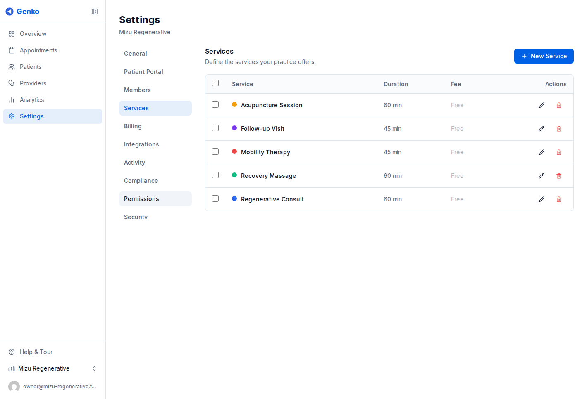

# Perfil de la práctica y servicios

El perfil de tu práctica explica quién eres, mientras que tus servicios definen lo que los pacientes pueden reservar. Ambos deben estar bien configurados antes de compartir el portal o invitar a un equipo más grande.

---

## Lo básico del perfil de la práctica

El perfil de tu práctica normalmente incluye:

- Nombre de la práctica
- Correo y teléfono de contacto
- Dirección y zona horaria
- Logo y detalles de marca

Mantén esta información actualizada para que los mensajes al paciente, el contexto del equipo y los detalles del portal sigan siendo correctos.

---

## Por qué importa el perfil

Un perfil completo ayuda a Genkō a presentar tu práctica con claridad en los lugares que más ven pacientes y personal:

- Flujos de reserva en el portal de pacientes
- Correos de confirmación y recordatorio
- Contexto operativo interno para tu equipo

También hace más limpio el onboarding de nuevos integrantes que necesitan entender cómo está organizada la práctica.

---

## Servicios y tipos de cita

Los servicios son los tipos de cita que ofrece tu práctica. Cada servicio puede incluir:

- **Nombre** como _Consulta inicial_
- **Duración** en minutos
- **Descripción** para explicar en qué consiste la visita

La duración del servicio se rellena automáticamente cuando el personal o el paciente reserva una cita, manteniendo la programación consistente sin impedir ajustes cuando sean necesarios.

---

## Gestión de servicios

Ve a **Settings → Services** para administrar tus tipos de cita.

Puedes:

- **Crear** un servicio nuevo con nombre, duración y descripción opcional
- **Editar** un servicio existente cuando cambie tu oferta
- **Archivar** un servicio que ya no quieres reservar, manteniéndolo visible en el historial

Archivar suele ser mejor que eliminar porque conserva el contexto de las citas pasadas.

---

## Consejos prácticos de configuración

Empieza con el catálogo más pequeño que siga siendo útil:

- Una visita más larga para pacientes nuevos
- Una visita más corta de seguimiento
- Cualquier servicio especializado que realmente necesite reglas propias

Esto facilita la reserva para el personal y mantiene el portal de pacientes más simple.

---

## Detalles de servicios por plan

Las capacidades de los servicios crecen con los planes:

- **Free** incluye un solo servicio
- **Solo** en adelante desbloquean múltiples servicios, tarifas opcionales por cita y cobro con Stripe
- **Practice** en adelante añaden buffer por servicio

Usa estas capacidades solo cuando resuelvan una necesidad operativa real. La mayoría de las prácticas debe empezar con una lista simple.

---

## Orden recomendado

1. Define el nombre de la práctica y los datos de contacto
2. Agrega un logo limpio si ya lo tienes
3. Crea tus servicios principales
4. Confirma que las duraciones sean realistas antes de activar la reserva de autoservicio

---

## Guías relacionadas

- [Proveedores y equipo](./05-gestion-de-personal.md)
- [Programación y citas](./06-programacion.md)
- [Portal de pacientes e integraciones](./07-comunicaciones.md)
