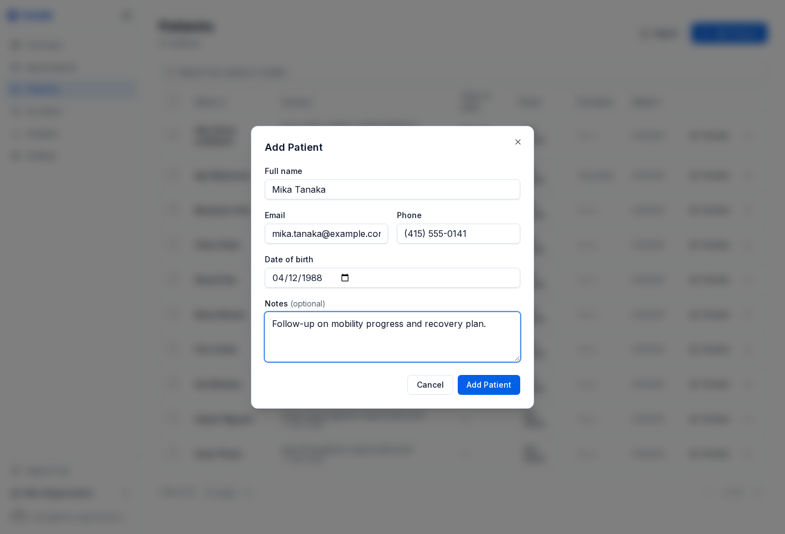

# Pacientes

La sección de pacientes almacena los registros que tu equipo necesita para programación, comunicación e historial de citas. Mantén los registros limpios y ligeros al principio, y agrega más detalle a medida que madure tu flujo de trabajo.

---

## Agregar pacientes

Abre **Patients** en la barra lateral y haz clic en **Add Patient**.

Los campos más comunes son:

- **Nombre completo** - obligatorio
- **Correo electrónico** - recomendado para confirmaciones y recordatorios
- **Teléfono** - útil para seguimiento o contacto manual
- **Fecha de nacimiento** - contexto clínico opcional
- **Notas** - detalles internos opcionales como preferencias o contexto importante

Si estás migrando una lista existente, usa **Import** para subir un CSV o un archivo de Excel en lugar de volver a capturarlo todo manualmente.

---

## Ver registros de pacientes

Haz clic en el nombre de un paciente para abrir su página de detalle. Desde ahí, tu equipo puede:

- Revisar datos de contacto
- Ver citas próximas y pasadas
- Agregar o editar notas internas
- Confirmar si el registro ya está vinculado con actividad del portal o reservas recientes

Genkō mantiene el flujo centrado en registros operativos, en lugar de exigir una configuración pesada antes de poder agendar al paciente.

---

## Permisos y privacidad

Por defecto:

- **Owners y admins** pueden editar y eliminar registros de pacientes
- **Providers y staff** pueden leer los registros

Esto mantiene ágil el flujo de reservas y al mismo tiempo protege cambios sensibles.

---

## Importación de pacientes

La importación masiva es útil cuando te mudas a Genkō desde otra herramienta de agenda o desde una hoja de cálculo.

Antes de importar:

- Normaliza nombres y datos de contacto
- Elimina duplicados obvios
- Mantén breves las notas opcionales

Después de importar, revisa algunos registros de muestra para asegurarte de que nombres, correos y teléfonos se vean bien antes de invitar al resto de tu equipo a trabajar con esos datos.

---

## Límites por plan

Los límites de pacientes dependen de tu suscripción:

| Plan | Límite de pacientes |
|------|---------------------|
| Free | 100 |
| Solo | 250 |
| Starter | 500 |
| Group | 1,000 |
| Practice | 5,000 |
| Enterprise | Ilimitado |

Cuando alcances el límite de tu plan, tendrás que mejorar antes de agregar más pacientes.

---

## Buenas prácticas

- Crea el registro del paciente antes de reservar siempre que sea posible para que tu equipo tenga una sola fuente de verdad.
- Usa las notas para contexto operativo, no para historiales largos en texto libre.
- Mantén actualizado el correo si dependes del portal y de los recordatorios.

---

## Guías relacionadas

- [Programación y citas](./06-programacion.md)
- [Portal de pacientes e integraciones](./07-comunicaciones.md)
- [Planes y facturación](./10-facturacion.md)
