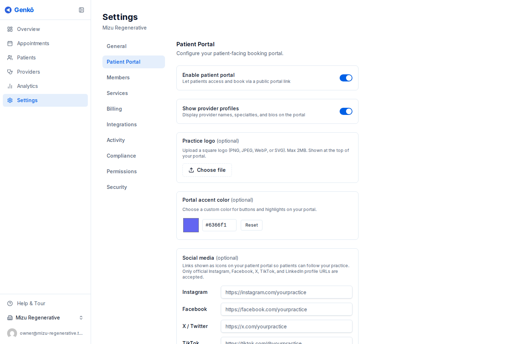
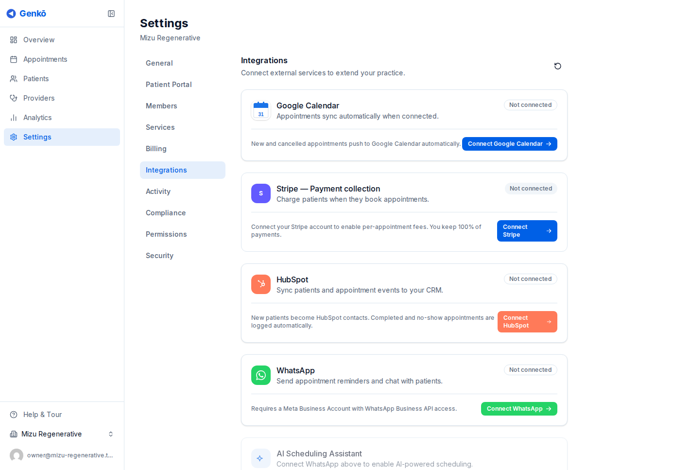

# Portal de pacientes e integraciones

Genkō permite a las prácticas abrir un portal de reserva de autoservicio y conectar herramientas operativas como Google Calendar. Es la forma más rápida de reducir trabajo manual de agenda sin perder control sobre la disponibilidad.

---

## Activar el portal de pacientes

Ve a **Settings → Portal** y activa **Enable Patient Portal**.

Una vez activo, tu práctica obtiene un enlace público de reserva basado en el slug de la organización. Compártelo donde tus pacientes ya interactúan contigo:

- Sitio web
- Firma de correo
- Correos de confirmación
- Flujos de referencia o intake

Antes de publicar el enlace, asegúrate de que tus servicios y horarios de proveedores sean correctos.

---

## Cómo funciona la reserva de autoservicio

Los pacientes siguen un flujo simple:

1. Exploran servicios disponibles y opciones de proveedor
2. Eligen servicio, proveedor, fecha y hora
3. Ingresan sus datos de contacto
4. Reciben un correo de confirmación

Las reservas aparecen en tu calendario de inmediato.

Si el correo electrónico ya coincide con un paciente existente, Genkō vincula la reserva a ese registro. De lo contrario, crea un paciente nuevo automáticamente.

---

## Por qué las prácticas usan el portal

El portal ayuda a:

- Reducir el ida y vuelta para reservas rutinarias
- Mostrar solo horarios válidos según agendas y reglas de reserva
- Crear registros de pacientes más limpios mediante datos consistentes

Funciona mejor cuando los nombres de los servicios son claros y la disponibilidad de los proveedores está actualizada.

---

## Sincronización con Google Calendar

Genkō puede sincronizar citas con Google Calendar para que los proveedores mantengan alineada su agenda entre herramientas.

Para conectarlo:

1. Ve a **Settings → Integrations**
2. Elige **Connect Google Calendar**
3. Inicia sesión con la cuenta de Google que quieres sincronizar
4. Otorga permisos de calendario
5. Selecciona el calendario de destino y confirma

---

## Qué se sincroniza

Una vez conectado:

- Las nuevas citas creadas en Genkō aparecen en Google Calendar
- Las citas reprogramadas se actualizan en Google Calendar
- Las citas canceladas también se reflejan allí
- Los nombres del proveedor, del paciente y las notas de la cita se incluyen en el evento

Cada proveedor puede conectar su propio calendario, así que la sincronización puede mantenerse personal en lugar de forzar un calendario compartido.

---

## Acceso por plan

- **El portal de pacientes** forma parte del flujo central de programación de Genkō
- **La sincronización con Google Calendar** está disponible en planes **Solo** y superiores

Desconectar Google Calendar no elimina eventos anteriores del calendario; simplemente detiene la sincronización futura.

---

## Buenas prácticas

- Publica el portal solo después de validar servicios y horarios
- Usa nombres de servicio claros para que los pacientes entiendan qué están reservando
- Anima a cada proveedor a conectar su propio calendario si gestiona su día desde Google Calendar

---

## Guías relacionadas

- [Perfil de la práctica y servicios](./03-perfil-de-negocio.md)
- [Proveedores y equipo](./05-gestion-de-personal.md)
- [Configuración, IA y API](./09-configuracion.md)
