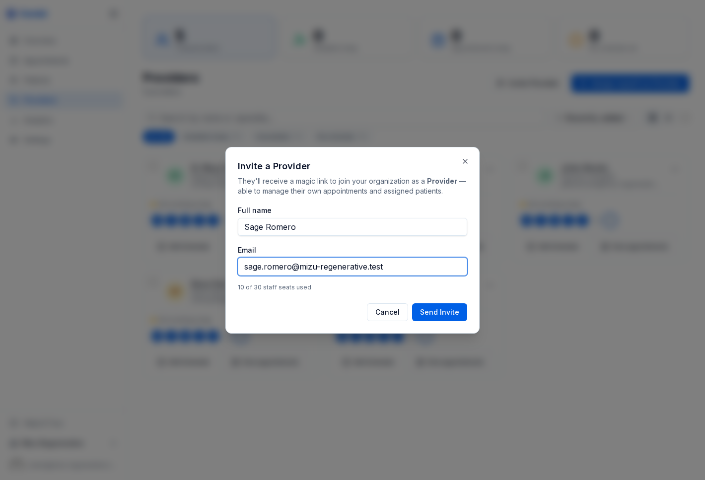
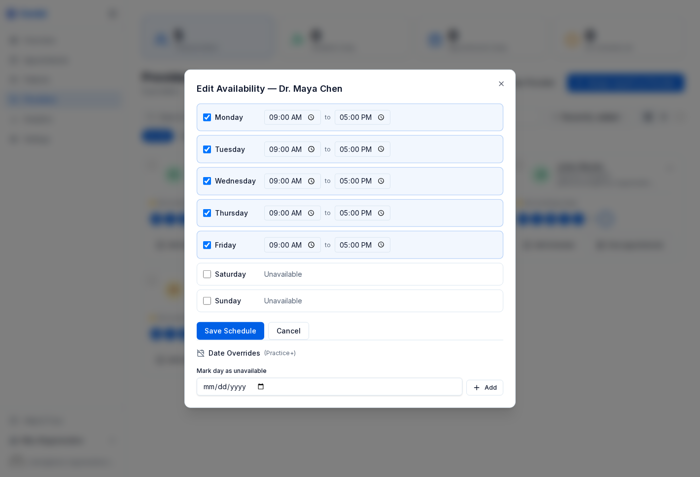
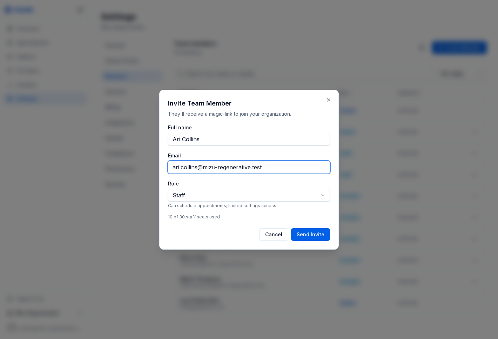
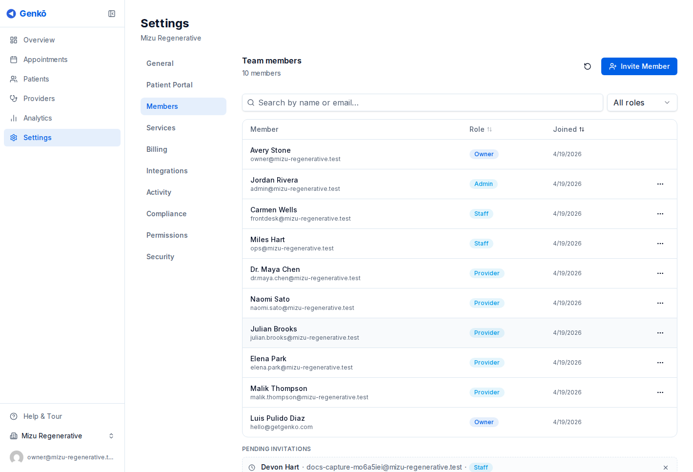

# プロバイダーとチーム

Genkō は、プロバイダー設定と一般的なチームアクセスを分けることで、臨床スケジュールと運用権限を整理しやすくしています。

---

## プロバイダーを追加する

一般的には次の 2 つの方法があります。

- **Invite Provider**: 臨床担当者をワークスペースに招待する
- **Assign yourself as Provider**: Owner 自身が患者を担当する場合に自分をプロバイダーとして登録する

招待後、プロフィールと空き時間が設定されると、プロバイダーはスケジュール画面に表示されます。

---

## プロバイダーの空き時間を設定する

プロバイダーカードを開き、**Edit Schedule** を選択して週間の空き時間を定義します。

各曜日について次の内容を設定できます。

- 利用可能かどうか
- 開始時刻と終了時刻
- たとえば月曜から金曜の 9 時から 17 時までのような単純な勤務パターン

Genkō はこのスケジュールを、予約が作成されるすべての場所で使用します。

- スタッフによる予約
- プロバイダーの表示
- ポータルでのセルフ予約

特定の日に利用不可の場合、その日は単に予約可能日として表示されません。

---

## 高度なスケジュールルール

**Practice** プラン以上では、次のようなより厳密なルールを追加できます。

- **Buffer minutes**（予約間の余白）
- **1 日あたりの最大予約数**
- **予約ウィンドウ**（どこまで先まで予約可能か）
- **曜日制限**（ポータルで予約可能な曜日を制限）

まずはシンプルに始め、実際の運用課題を解決する必要が生まれたときだけ追加するのがよいでしょう。

---

## チームメンバーを招待する

**Settings → Members** に進み、**Invite Member** をクリックします。

各招待に含まれる内容:

- 氏名
- メールアドレス
- ロール

Genkō はマジックリンク付きの招待メールを送信します。保留中の招待はメンバーページで確認・取り消しでき、**72 時間**で期限切れになります。

---

## ロールと権限

Genkō には 4 つの主要ロールがあります。

| ロール | 主な用途 |
|--------|----------|
| Owner | 請求や所有権移譲を含む組織全体の完全管理 |
| Admin | 幅広い運用アクセスが必要なマネージャー |
| Provider | 予約管理と患者記録閲覧を行う臨床担当者 |
| Staff | 設定や請求権限を持たずに予約業務を支援するスタッフ |

Owner と Admin は、いつでもロール変更やメンバー削除を行えます。

---

## チーム上限

プラン上限は Owner を除くチームメンバー数に適用されます。大量招待の前に、請求画面で現在の使用量を確認してください。

---

## ベストプラクティス

- セルフ予約を有効にする前にプロバイダーを追加する
- チームメンバーは必要最小限のロールで招待する
- 患者やスタッフが適切な臨床担当者を選びやすいよう、専門分野やプロフィール文を活用する

---

## 関連ガイド

- [診療所プロフィールとサービス](./03-ビジネスプロファイル.md)
- [予約とスケジュール](./06-スケジュール.md)
- [プランと請求](./10-請求.md)
